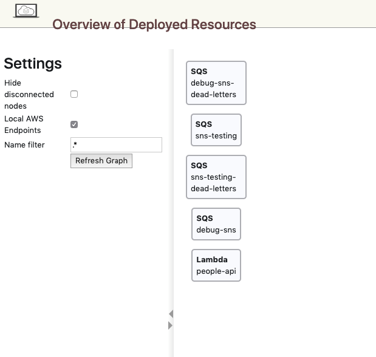

# Serverless Local Environment

This repository contains the scripts and configuration needed to spin up and maintain a local instance of a serverless platform.

- [Overview](#overview)
    - [What's Included](#what)
    - [The Environment](#env)
    - [Caveats](#caveats)
- [Quickstart](#quickstart)
- [Scripts](#scripts)
- [Config](#config)
- [Visualise Environment](#visual)
    - [Kibana](#kibana)
    - [Weave Scope](#scope)
    - [Localstack Dashboard](#localstack)
- [Log Files](#logfiles)
    - [Docker](#dockerlogfiles)
    - [Lambda](#lambdalogfiles)
    - [ELK Stack](#elkstack)
- [Common Environment Tasks](#tasks)
    - [Restarting Services](#restart)
    - [Reading Logs](#dockerlogs)
    - [Reading Lambda Logs](#lambdalogs)
    - [Accessing Containers](#config)
    - [Manage AWS Resources](#aws)
- [Development Environment](#devenv)
    - [Tools Needed](#tools)

## Overview<a id="overview"></a>

This section gives a high level overview of the serverless local environment.

### <a id="what"></a>What's Included

- Orchastration Scripts:
    - Up/Down environment
    - Build custom docker images
    - Deploy lambda packages
    - Create AWS resources
- Application Configs
- Log files for Docker apps & Lambda's
- ELK stack
- Development Tools Installer (OSX only)
- Integration with Weave Scope (see `Visualise Environment`)

### <a id="env"></a>The Environment

- Mock AWS Services (SQS, S3, SNS, Lambda etc.)
- Mock ALB for AWS Lambda Functions

*See the `serverless-env/README.md` file for more information on services, URLs and config*

### <a id="caveats"></a>Caveats

- AWS services are mocked using localstack, which does not 100% reflect real world AWS behaviour
- AWS Lambda's run inside localstack using Docker containers
- You will need to allow docker to consume a decent amount of memory, localstack alone consumes 4GB of RAM when all services are enabled

----

## <a id="quickstart"></a>Quickstart

- Install development tools for spinning up the environment, see: `Development Environment`

- If using Docker for Mac or Windows, ensure it is configured to be able to use at least `8GB` of your machine's RAM, to configure this: click the docker icon -> Perferences... -> General -> Memory

- If you have a `~/.aws/config` file, ensure it is set up to match the values in `serverless-env/config/aws-config.env`

- Then run:

    ```bash
    ./up
    ```

- Once this is complete you can access services on localhost

- You can destroy your environment by running:

    ```bash
    ./down
    ```

----

## <a id="scripts"></a>Scripts

You can run selectively deploy parts of the local environment using the below scripts:

*Note: all scripts reside in the `scripts` directory*

 - `up-env.sh`: Bring up docker services, create AWS resources and deploy Lambda Functions
 
 - `up-aws.sh`: Bring up localstack, create AWS resources and deploy Lambda Functions
 
 - `build-custom-images.sh`: Build any custom docker images not available on Docker Hub (including custom services); this script pulls a git repo and builds the `Dockerfile` inside. You can pass the `--image` flag with a docker image name to build one image only; e.x. `--image my-api`

 - `deploy-lambda-functions.sh`: Deploy Lambda Functions to localstack; this script using a local or http(s) package. You can pass the `--function` flag with a function name to deploy one function only; e.x. `--function api`

 By default the above scripts will not create a service or resources that already exist, pass various `--clean` options to  scripts to recreate existing resources. Run `./up --help` to view options.

----

## <a id="config"></a>Config

The `config` directory holds `.env` files which provide configuration for the scripts in this repo.

- `aws-services`: Required AWS resources
- `custom-images`: Custom docker image definitions
- `lambda-functions`: Lambda function definitions

See the config file for more info.

----

## <a id="visual"></a>Visualise Environment

The default environment setup includes several web-apps that are useful for understanding and debugging the platform.

### <a id="kibana"></a>Kibana

An ELK stack is installed as part of the local environment. It will ingest log files from docker applications and lambda functions. These are parsed to provide some key metadata, such as:

- HTTP Requests (path, method, query string)
- Lambda Stats (request id, duration, memory used)
- Platform Type (docker, lambda)

#### Access logs

- Go to http://localhost:5601/app/kibana#/management/kibana/index_patterns/
- Create a new index pattern, using the pattern: `*-logs`
- Use `@timestamp` for the time filter field
- You can now discover logs and start querying by going to [http://localhost:5601/app/kibana#/discover?_g=(refreshInterval:(pause:!t,value:0),time:(from:now%2Fd,to:now%2Fd))](http://localhost:5601/app/kibana#/discover?_g=(refreshInterval:(pause:!t,value:0),time:(from:now%2Fd,to:now%2Fd)))


### <a id="scope"></a>Weave Scope

Scope is a powerful Docker infastructure visualisation and querying tool. It exposes a web ui which shows all containers, network connections, volumes, processes, environment variables and much more.

It is especially good at inspecting the connections between services.

If you installed the dev tools using `scripts/install-dev-tools.sh` or manually installed scope, it is accessible @ http://localhost:4040


*Note: You can filter by image name or network to see only the `serverless-env` environment*

### <a id="localstack"></a>Localstack Dashboard

AWS services are provided by the `localstack` stack, it exposes a simple UI for quickly viewing deployed AWS resources @ http://localhost:8888



----

## <a id="logfiles"></a>Log Files

All docker applications and lambda functions will produce log files. You can find these @ `serverless-env/.volumes/logs`

### <a id="dockerlogfiles"></a>Docker

Docker log files are generated by the logging libraries of the applications themselves (log4j, dropwizard etc.) and can be tweaked in the app config files.

### <a id="lambdalogfiles"></a>Lambda

By default all Lambda Functions will emit logs to Cloudwatch Logs, which is hosted locally by the `aws` service. 

The `lambda_logger` service uses the `serverless-env/scripts/lambda-logger/monitor-lambda-logs.sh` script to poll Cloudwatch, writting log event lines to log files in `serverless-env/.volumes/logs/lambda`. Each lambda will generate an individual log file.

See [Reading Lambda Logs](#)

### <a id="elkstack"></a>ELK Stack

As described in the [Kibana](#kibana) section, an ELK stack is installed locally for you. 

The stack is configured to ingest logs from docker apps and lambda functions automatically and index these in elasticsearch.

Below is the workflow for indexing log events:

- Logs are generated by docker applications and the `lambda_logger` service (see [Lambda](#lambdalogfiles)) 

- Logs files are saved in `serverless-env/.volumes/logs`

- The `filebeat` service monitors the `lambda` & `docker` directories for new logs files and log file changes (see `serverless-env/config/elk/filebeat.yml`)

- `filebeat` sends these log file events to the `logstash` service, using grok patterns to parse log lines and assign tags (see `serverless-env/config/elk/logstash.conf`)

- `logstash` sends all successfully parsed events to the `elasticsearch` service

- At this point data can be manually queried or the `kibana` service can be used to discover log events

----

## <a id="tasks"></a>Common Environment Tasks

This sections shows how to preform common tasks in the serverless local envrionment.

### <a id="restart"></a>Restarting Services

A convience wrapper around the `docker-compose` package is in the root directory:

Soft Restart (restart container process):

    ./docker-compose restart api

Hard Restart (recreate container):

    ./docker-compose up --force-recreate api 

*Note: when you restart the `aws` service you will lose some resources as they only persist in memory*

### <a id="dockerlogs"></a>Reading Logs

    ./docker-compose logs api

Tail:

    ./docker-compose logs --tail 10 api

Follow (can be combined with tail):

    ./docker-compose logs --follow api

### <a id="lambdalogs"></a>Reading Lambda Logs

There is a script `scripts/get-lambda-logs.sh` that will dump out log messages from a Lambda Function using Cloudwatch:

    ./scripts/get-lambda-logs.sh --function metadata-service

See the `--help` options for more info on how to tail and watch logs.

Also, logs can be manually queried using the `./aws` command line:

```shell
./aws logs filter-log-events --log-group-name /aws/lambda/<name-of-lambda>
```

A list of log groups can be found by running:

```shell
./aws logs describe-log-groups
```

*Remember that a lambda log group will not be created until the first request for that function is processed*

### <a id="config"></a>Accessing Containers

You can open an interactive shell within a service container by running:

    ./docker-compose exec api /bin/sh

### <a id="aws"></a>Manage AWS Resources

A convience wrapper around the `awslocal` package is in the root directory:

    ./aws s3api list-buckets

----

## <a id="devenv"></a>Development Environment

If you are running OSX a convience script is provided to install tools required:

- Ensure your `~/.bash_profile` or `~/.zshrc` file is created (run `echo $SHELL` to see which shell you are running if unsure)

- Run:

    ```bash
    ./scripts/install-dev-tools-osx.sh --help
    ```

- This will show you the options available

- Run the script with your desired options to install your dev tools

### <a id="tools"></a>Tools Needed

If you are on another platform or want to manually install tools, you will need:

| Tool   | Version   | Notes                                                           |
|--------|-----------|-----------------------------------------------------------------|
| docker | latest    |                                                                 |
| python | latest    |                                                                 |
| pipenv | latest    |                                                                 |
| Weave Scope  | latest    | Optional, but nice debugging tool (see `Visualise Environment`) |
